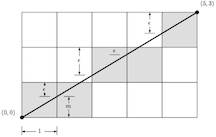
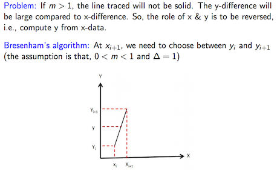
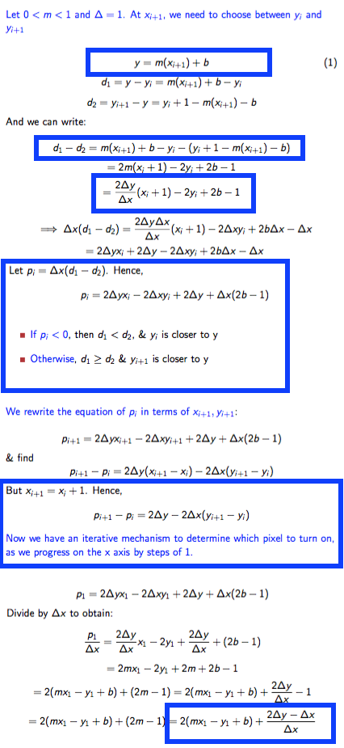
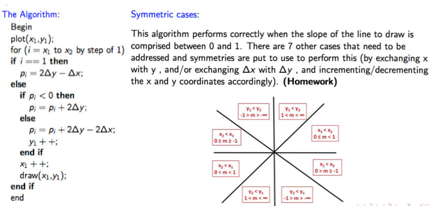
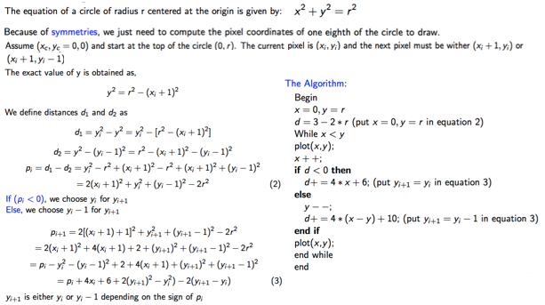

# 03: Bresenham's Algorithms

##Rasterization
    - vector data to rasters(pixel/dot format)
    - **scan conversion** figures out what pixels to shade to represent the shapes you desire to draw

##Bresenham’s line drawing algorithm
- basically what it does is ∆y = m∆x

##Bresenham’s circle drawing algorithm
