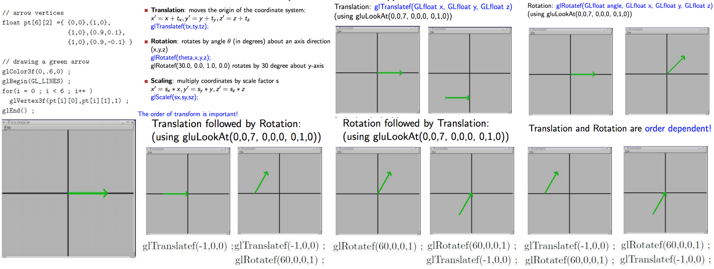
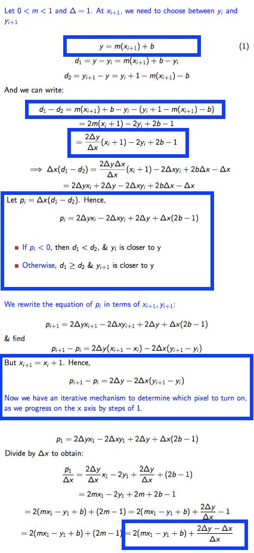
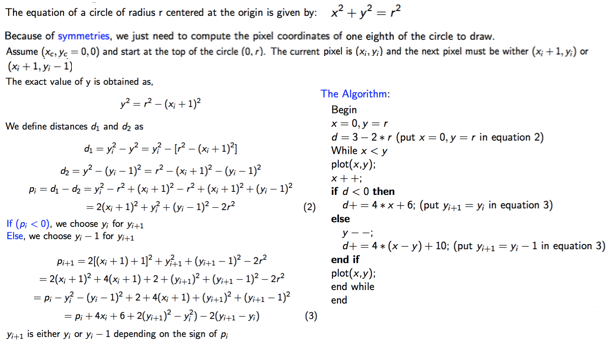

#CS 3388 Notes

##Table of Contents

- [01: Intro to Computer Graphics](#01:-intro-to-computer-graphics)
	- [Setting Up in XCode](#setting-up-in-xcode)
- [02: OpenGL Basics](#02-openGL-basics)
    - [Functionalities](#functionalities)
    - [Data Types](#data-types)
    - [Input/Output](#input-output)
    - [Transformation](#transformation)
    - [Projection](#projection)
    - [Clipping](#clipping)
    - [Camera metaphor](#camera-metaphor)
- [03: Bresenham's Algorithms](#03:-bresenham's-algorithms)
    - [Rasterization](#rasterization)
    - [Bresenham’s line drawing algorithm](#bresenham’s-line-drawing-algorithm)
    - [Slope issues](#slope-issues)
    - [Bresenham’s circle drawing algorithm](#bresenham’s-circle-drawing-algorithm)
- [04: Geometric Transformations](#04-geometric-transformations)
- [05: Viewing and Projections](#05-viewing-projections)
- [06: Clipping](#06-clipping)
- [07: Mesh Data Structures](#07-mesh-data-structures)
- [08: Curve and Surface Design](#08-curve-and-surface-design)
- [09: Lightning Models](#09-lightning-models)
- [10: Ray Tracing](#10-ray-tracing)
- [11: Fractals](#11-fractals)


#01: Intro to Computer Graphics


**Computer Vision**: understanding image content (by creating models)

**Computer Graphics**: Creating an image from scratch (using a computer model)

##Setting Up in XCode
- Create new Command Line Tool
- Click on your project name then click on *Build Phases*

Link Frameworks:
- Click ‘*Link Binary With Libraries*’
- Click the + button
- Type *OpenGL* in the search box, Click *OpenGL.framework*, then click *Add*
- Click the + button again
- Type *glut* in the search box, Click *GLUT.framework*, then click *Add* 

Remove Depreciation Warnings (GLUT OpenGL files have been depreciated)
- Click the *Build Settings* tab
- In the search bar on the top right of the tab, type *deprecated*
- Under *Apple LLVM – Warnings – All Languages*, look for “*Deprecated Functions*” setting
- Change the setting to “No”

Include libraries in your project
- select main.c
- add the following files:

```c++
#include <OpenGL/gl.h>
#include <OpenGL/glu.h>
#include <GLUT/glut.h>
```

Done!

#02: OpenGL Basics

**Open GL**: 
- low level software direct interface to graphics hardware
- OS & graphics hardware independent, cross-platform
- State Machine: put into a state/mode, it remains til you change it. Each window = it's own state
    - Event Driven Programming (call back functions, event loops, register callback functions)
- Industry Standard (ArchitectureReview Board steers it)
- Extensible
- Can be called as an API


##Functionalities
- Draw points/lines/polygons
- Transformations (matrix ops)
- Z-Buffer (surface Removal)
- Phong Model (Lighting)
- Shading
- Texture Mapping

##Libraries
- GL: fundamental
- GLU: utility library (high level routines)
- GLUT: utility toolkit (open a window, get input, etc.)

##Data Types


##Syntax

- 'gl' prefixes all OpenGL
- 'GL_' prefixes defined constants
- most contants are defined in gl.h, glu.h, and glut.h, '# include<glut.h>' should automatically include the others
- Commands postfixes:
    - **number** {2, 3, 4} for number of arguments (e.g. `glVertex2i()`)
    - **letter** {i, f , d, ub} for data type of the arguments (e.g. `glRectf()`)
    - **v** if argument is a vector (array) (e.g.glVertex3fv())
- `glColor` sets colours:
    - RGB or RGBA in floating pt(0-1) & unsigned byte(0-255) i.e.:
    ```c++
    glColor3f(0.0,0.5,1.0);
    //(0% Red, 50% Green, 100% Blue)
    glColor4f(0.0,0.5,1.0,0.3);
    //(0% Red, 50% Green, 100% Blue, 30% opacity)
    GLfloat color[4] = {0.0,0.5,1.0,0.3};
    glColor4fv(color);
    //(0% Red, 50% Green, 100% Blue, 30% opacity)

    glColor3ub(0,127,255);
    //(0% Red, 50% Green, 100% Blue)
    glColor4f(0,127,255,76);
    //(0% Red, 50% Green, 100% Blue, 30% opacity)
    GLubyte color[4] = {0,127,255,76};
    glColor4ubv(color);
    //(0% Red, 50% Green, 100% Blue, 30% opacity)
    ```
- `glClearColor(0,0,1.0,1.0)` sets background color - always in FLOATING POINT
- `glClear(GL COLOR BUFFER BIT);` at thetop of display() function to reset the colour buffer 

##Input-Output

- Keyboard Input =  glutKeyboardFunc(keyboard) Ex: `keyboard(unsigned char key, int x, int y);`
- Mouse input = glutMouseFunc(mouse) Ex: `mouse(int button, int state, int mousex, int mousey);`

###Points
* `glVertex\*()` must be within glBegin(constant) and glEnd() commands *
- 2D: `glVertex2f(1.0, 2.0);`
- 2D: `glVertex2i(4, -1);`
- 3D: `glVertex3f(10, 20, 30);`

EX. to draw 4 points:
```c++
glBegin(GL POINTS);
glVertex2i(0,0);
glVertex2i(1,0) ;
glVertex2i(1,1) ;
glVertex2i(0,1) ;
glEnd() ;
```

EX. to draw 2 lines:
```c++
glBegin(GL LINES);
glVertex2i(0,0);
glVertex2i(1,0) ;
glVertex2i(1,1) ;
glVertex2i(0,1) ;
glEnd() ;
```

EX. draw a square:
```c++
glBegin(GL LINE LOOP);
glVertex2i(0,0);
glVertex2i(1,0) ;
glVertex2i(1,1) ;
glVertex2i(0,1) ;
glEnd() ;
```
EX. draw a filled square/quad:
```c++
glBegin(GL QUADS);
glVertex2i(0,0);
glVertex2i(1,0) ;
glVertex2i(1,1) ;
glVertex2i(0,1) ;
glEnd() ;
```

- `glBegin(constant)` expects a certain ordering of vertices to produce the expected result (POLYGON verticies are counter clockwise)
##Camera metaphor
Imagine that OpenGL has a (virtual) camera which is taking a picture of the (virtual) world. You have to choose what part of the world is seen, and how the camera sees the world.
TODO:
- specify camera position and orientation
- specify position and oritention of objects camera will see

##Transformation
Verticies rotated and translated into place

- Transformation calls in OpenGL multiply a matrix which represents the transformation into the current OpenGL state then save and restore the modelview matrix state 
- must do int eh following order!!!

Translation: moves the origin of the coordinate system:
x0 =x + tx , 
y0 = y + ty , 
z0 = z + tz
glTranslatef(tx,ty,tz);
Rotation: rotates by angle θ (in degrees) about an axis direction
(x,y,z)
glRotatef(theta,x,y,z);
glRotatef(30.0, 0.0, 1.0, 0.0) rotates by 30 degree about y-axis
Scaling: multiply coordinates by scale factor s
x0 = sx ∗ x, 
y0 = sy ∗ y, 
z0 = sz ∗ z
glScalef(sx,sy,sz);
The order of transform is important!


###Projection Transformation
- determines what the camera sees and how it sees the world
- defines point/vertex transformation from world space(what you're modelling) to 2D plane/screen
    - world coordinate numbers(vertices) are UNITLESS i.e. `glVertex2i(2,3)` purposely has no units!
- projection transform is represented in a 4x4 matrix, and supports **Orthographic** and **Perspeective** transformations
- when `glOrtho()` `gluPerspective()` or `glFrustum` is executed a matrix which produces a projection transformation for the requested viewing volume is generated, then multiplied into the current OpenGL state


###modelview Transformation
- concerned w/ camera/object position and orientation
- Transformation calls in OpenGL multiply a 4x4 matrix which represents the transformation into the current OpenGL state
- **glPushMatrix()** saves the modelview state pushes the current matrix on to a stack, duplicating the current matrix. That is, after a glPushMatrix call, the matrix on top of the stack is identical to the one below it
- **glPopMatrix()** restores the modelview state pops the current matrix stack, replacing the current matrix with the one below it on the stack


##Projection
projection of verticies onto the image plane are calculated
The OpenGL camera is placed at origin in object space, pointing in -z direction
Orthograohic Projection points are projected FORWARD along z axis onto plane z=0


###Viewing
**Viewport**: rectangular area of window where OpenGL draws, in pixels
`glViewport(lowerX, lowerY, width, height)`
usually put into glutReshapeFunc();

!(glulookat camera/viewing matrix](glulookat)

EX 1: `void gluLookAt( 0,0,-5, 0,0,0, 0,1,0 ) ;`
Camera is at -5 on z-axis, looking at the origin, coincident with the positive y-axis
EX 2: `void gluLookAt( 10,0,0, 0,0,0, 0,0,1 ) ;`
Camera is at 10 on x-axis, looking at the origin, coincident with the positive z-axis

####To Specify a View
1. set the viewport
2. set the projection Transformation
3. set the modelview transformation
- Set the projection/modelview modes transformation state to default ’no transformation’ state.
- Change between the projection and modelview states
- Default projection View transformation: `glMatrixMode(GL PROJECTION) ; glLoadIdentity();`
    - equivalent to    `glMatrixMode(GL PROJECTION) ; glOrtho(-1,1, -1,1, 1,1) ;`
    - EX: 
    ```c++
    glMatrixMode(GL PROJECTION) ;
    glLoadIdentity() ;
    gluPerspective(45,1,5,100) ;
    ```
- default modelview transformation: `glMatrixMode(GL MODELVIEW) ; glLoadIdentity() ;`
    - equivalent to    `glMatrixMode(GL MODELVIEW) ; gluLookAt(0,0,0, 0,0,-1, 0,1,0) ;`
    - EX:
    ```c++
    glMatrixMode(GL MODELVIEW) ;
    glLoadIdentity() ;
    gluLookAt(0,0,0, 0,0,-1, 0,1,0) ;
    ```
- `glLoadIdentity();` sets transformation to the identity matrix (default state)


Using both projection and modelview transformations in a single example:
```c++
void reshape(int x, int y){
glViewPort(x,y) ;
glMatrixMode(GL PROJECTION) ;
glLoadIdentity() ;
gluPerspective(45,1,5,100) ;
glMatrixMode(GL MODELVIEW) ;
glLoadIdentity() ;
gluLookAt(0,0,10, 0,0,-1, 0,1,0) ;
}
```

##Clipping
Vertices outside the image plane are clipped away

#03: Bresenham's Algorithms
##Rasterization
    - vector data to rasters(pixel/dot format)
    - **scan conversion** figures out what pixels to shade to represent the shapes you desire to draw

##Bresenham’s line drawing algorithm
- basically what it does is ∆y = m∆x





##Bresenham’s circle drawing algorithm


#04: Geometric Transformations
#05: Viewing and Projections
#06: Clipping
#07: Mesh Data Structures
#08: Curve and Surface Design
#09: Lightning Models
#10: Ray Tracing
#11: Fractals
