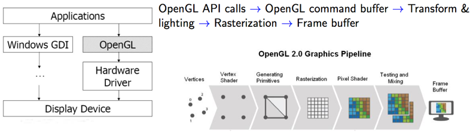
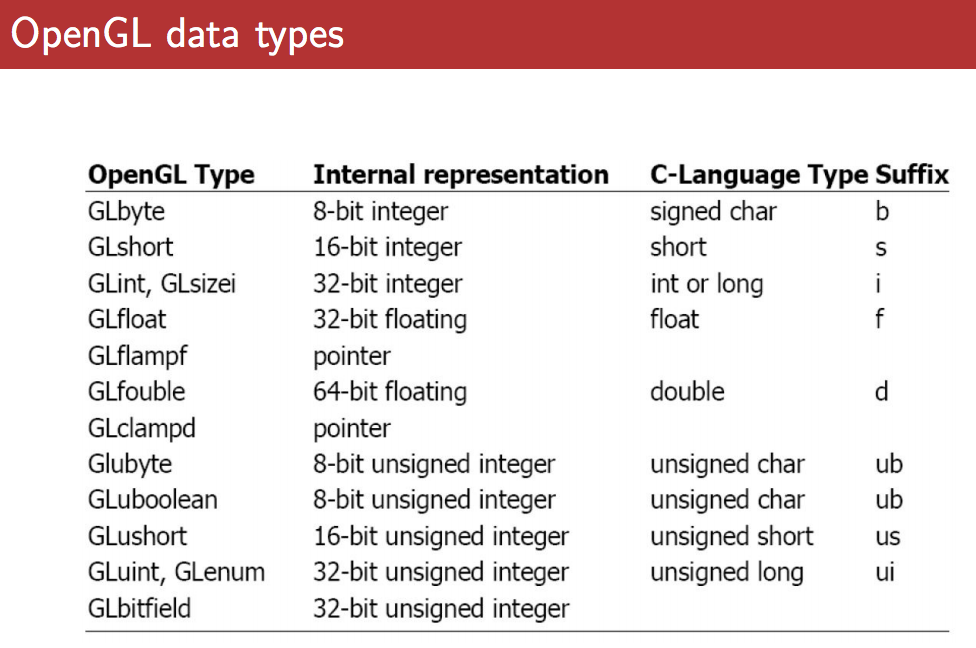
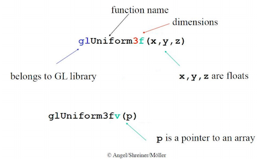
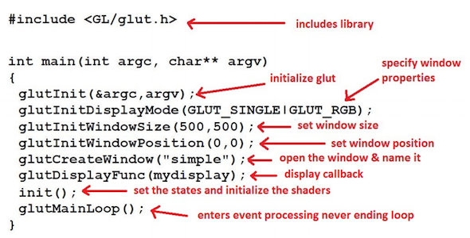

#CS 3388 Notes

##Table of Contents

- [01: Intro to Computer Graphics](#01:-intro-to-computer-graphics)
	- [Setting Up in XCode](#setting-up-in-xcode)
- [02: OpenGL Basics](#02-openGL-basics)
    - [Functionalities](#functionalities)
    - [Data Types](#data-types)
    - [Input/Output](#input-output)
    - [Projection](#projection)
    - [Viewing](#viewing)
    - [Transformation](#transformation)
    - [Camera metaphor](#camera-metaphor)
- [03: Bresenham's Algorithms](#03:-bresenham's-algorithms)
- [04: Geometric Transformations](#04-geometric-transformations)
- [05: Viewing and Projections](#05-viewing-projections)
- [06: Clipping](#06-clipping)
- [07: Mesh Data Structures](#07-mesh-data-structures)
- [08: Curve and Surface Design](#08-curve-and-surface-design)
- [09: Lightning Models](#09-lightning-models)
- [10: Ray Tracing](#10-ray-tracing)
- [11: Fractals](#11-fractals)


#01: Intro to Computer Graphics


**Computer Vision**: understanding image content (by creating models)

**Computer Graphics**: Creating an image from scratch (using a computer model)

##Setting Up in XCode
- Create new Command Line Tool
- Click on your project name then click on *Build Phases*

Link Frameworks:
- Click ‘*Link Binary With Libraries*’
- Click the + button
- Type *OpenGL* in the search box, Click *OpenGL.framework*, then click *Add*
- Click the + button again
- Type *glut* in the search box, Click *GLUT.framework*, then click *Add* 

Remove Depreciation Warnings (GLUT OpenGL files have been depreciated)
- Click the *Build Settings* tab
- In the search bar on the top right of the tab, type *deprecated*
- Under *Apple LLVM – Warnings – All Languages*, look for “*Deprecated Functions*” setting
- Change the setting to “No”

Include libraries in your project
- select main.c
- add the following files:
<!---->
<!--```c++-->
<!--#include <OpenGL/gl.h>-->
<!--#include <OpenGL/glu.h>-->
<!--#include <GLUT/glut.h>-->
<!--```-->

Done!

#02: OpenGL Basics

**Open GL**: 
- low level software direct interface to graphics hardware
- OS & graphics hardware independent, cross-platform
- State Machine: put into a state/mode, it remains til you change it. Each window = it's own state
    - Event Driven Programming (call back functions, event loops, register callback functions)
- Industry Standard (ArchitectureReview Board steers it)
- Extensible
- Can be called as an API



##Functionalities
- Draw points/lines/polygons
- Transformations (matrix ops)
- Z-Buffer (surface Removal)
- Phong Model (Lighting)
- Shading
- Texture Mapping

##Libraries
- GL: fundamental
- GLU: utility library (high level routines)
- GLUT: utility toolkit (open a window, get input, etc.)

##Data Types



##Syntax

- 'gl' prefixes all OpenGL
- 'GL_' prefixes defined constants
- most contants are defined in gl.h, glu.h, and glut.h, '# include<glut.h>' should automatically include the others
- Commands postfixes:
    - **number** {2, 3, 4} for number of arguments (e.g. 'glVertex2i()')
    - **letter** {i, f , d, ub} for data type of the arguments (e.g. 'glRectf()')
    - **v** if argument is a vector (array) (e.g.glVertex3fv())
- 'glColor' sets colours:
    - RGB or RGBA in floating pt(0-1) & unsigned byte(0-255) i.e.:
    '''c++
    glColor3f(0.0,0.5,1.0);
    //(0% Red, 50% Green, 100% Blue)
    glColor4f(0.0,0.5,1.0,0.3);
    //(0% Red, 50% Green, 100% Blue, 30% opacity)
    GLfloat color[4] = {0.0,0.5,1.0,0.3};
    glColor4fv(color);
    //(0% Red, 50% Green, 100% Blue, 30% opacity)

    glColor3ub(0,127,255);
    //(0% Red, 50% Green, 100% Blue)
    glColor4f(0,127,255,76);
    //(0% Red, 50% Green, 100% Blue, 30% opacity)
    GLubyte color[4] = {0,127,255,76};
    glColor4ubv(color);
    //(0% Red, 50% Green, 100% Blue, 30% opacity)
    '''
- 'glClearColor(0,0,1.0,1.0)' sets background color - always in FLOATING POINT
- 'glClear(GL COLOR BUFFER BIT);' at thetop of display() function to reset the colour buffer 

##Input-Output

- Keyboard Input =  glutKeyboardFunc(keyboard) Ex: 'keyboard(unsigned char key, int x, int y);'
- Mouse input = glutMouseFunc(mouse) Ex: 'mouse(int button, int state, int mousex, int mousey);'

###Points
- 2D: 'glVertex2f(1.0, 2.0);'
- 2D: 'glVertex2i(4, -1);'
- 3D: 'glVertex3f(10, 20, 30);'
* 'glVertex\*()' must be within glBegin(constant) and glEnd() commands *

##Projection

##Viewing

##Transformation

##Camera metaphor

#03: Bresenham's Algorithms
#04: Geometric Transformations
#05: Viewing and Projections
#06: Clipping
#07: Mesh Data Structures
#08: Curve and Surface Design
#09: Lightning Models
#10: Ray Tracing
#11: Fractals
